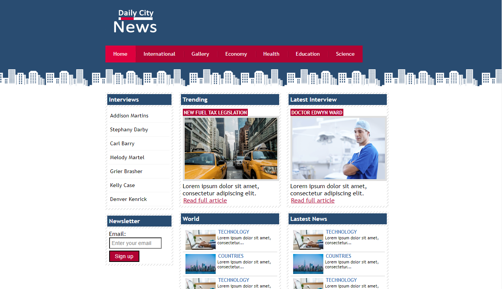

# Daily City News

This project is a website prototype of a fictional  newspaper named Daily City News.
It was coded with intermediate HTML and CSS, with the purpose of showing that it's possible to 
create a simple but well designed website with intermediate HTML and CSS.

## Screenshot 

## Top Nav Bar Items That Have Content
+ Home
+ International 
+ Gallery 

## Technology Stack

+ HTML
+ CSS
+ Image Editing